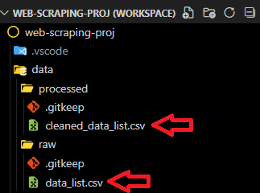
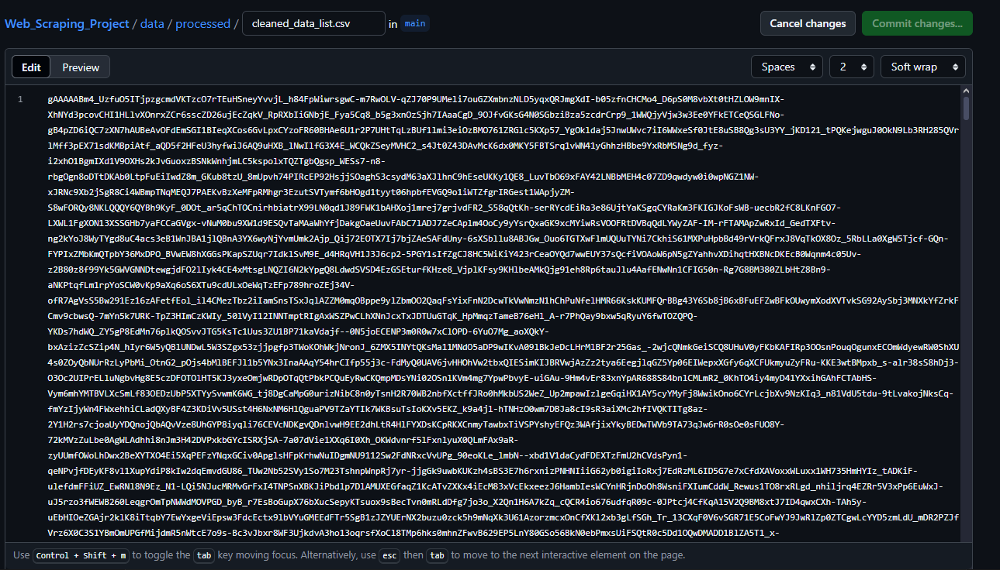

# Web Scraping Project

[](https://www.linkedin.com/in/mrjxtr)
[](https://www.upwork.com/freelancers/~01f2fd0e74a0c5055a?mp_source=share)
[](https://www.facebook.com/mrjxtr)
[](https://www.instagram.com/mrjxtr)
[](https://www.threads.net/@mrjxtr)
[](https://twitter.com/mrjxtr)
[](mailto:youremail@gmail.com)

## Overview

This project aims to build a web scraping pipeline for extracting data from static websites with pagination based on alphabetical letters (e.g., A, B, C, D). The pipeline is designed to extract data, organize it into a DataFrame, and ensure that it is clean and ready for use at the end of the process. The scripts are written in Python to be easily modifiable, reusable, and maintainable. Additionally, any potentially sensitive data is handled securely to protect privacy and data integrity.

## Technologies Used

The following technologies and libraries are utilized in this project:

- **Python**: The primary programming language used to build the web scraping pipeline.
- **Pandas**: A powerful library for data manipulation, cleaning, and organization, ensuring the scraped data is structured and ready for analysis.
- **Requests**: A user-friendly library to make HTTP requests, allowing us to retrieve web pages for scraping.
- **BeautifulSoup**: A parsing library that helps in navigating and extracting data from HTML and XML files.
- **python-dotenv**: A library to manage environment variables securely, ensuring sensitive data (like API keys or credentials) is kept out of the source code.
- **Cryptography**: A library for secure encryption and decryption of data.

## Project Components

This project consists of the following components:

1. **Web Scraper Script (`scraper.py`)**: A Python script that scrapes data from static websites with alphabetical pagination (e.g., pages A, B, C). It uses libraries like `Requests` to fetch web pages and `BeautifulSoup` to parse and extract data.

2. **Data Cleaning Script (`data_cleaner.py`)**: A Python script that takes the raw scraped data and transforms it into a clean and structured format, utilizing `Pandas` for data manipulation and handling.

3. **Main Script (`main.py`)**: The primary orchestration script that sequentially runs both the web scraper and data cleaning scripts, managing the entire data extraction and preparation pipeline.

4. **Encryption Script (`config.py`)**: A configuration module where the code for encryption and decryption of sensitive data is stored.

   1. **Manual Encryption Script (`encrypter.py`)**: A script for manual data encryption using the Encrypt class in the `config.py` module.

   2. **Manual Decryption Script (`decrypter.py`)**: A script for manual data decryption using the Encrypt class in the `config.py` module.

5. **Environment File (`.env`)**: A file containing sensitive data like encryption/decryption keys, links to websites used as data source for the scraper. *(Excluded from version control)*

## Project Structure

```txt
Web_Scraping_Project/
│
├── data/
│   ├── raw/                  <- Folder for raw data (Files are encrypted for privacy and security)
│   └── processed/            <- Folder for cleaned data (Files are encrypted for privacy and security)
│
├── docs/                     <- Documentation
│
├── references/
│   └── folder_structure.txt  <- Folder structure
│
├── scripts/
│   ├── utility/              <- Config modules
│   ├── data_cleaner.py       <- Script for data cleaning
│   ├── main.py               <- Main script that orchestrates the scraping and cleaning
│   └── scraper.py            <- Script for web scraping
│
├── .env                      <- Environment file for sensitive data. (Excluded from version control)
├── .gitignore                <- Git ignore file
├── requirements.txt          <- Project requirements
├── LICENCE.txt               <- Open-source license
└── README.md                 <- Project documentation
```

## Usage

1. **Setup**: Ensure all required Python libraries are installed:

   ```bash
   pip install -r requirements.txt
   ```

2. **Create a `.env` file**: Create a `.env` file in the root directory of the project to store encryption/decryption keys, links to websites used as data source for the scraper.

   ```.env
   # Web Scraping Configuration
   BASE_URL=https://www.website/you/want/to/scrape/
   REFERER_URL=https://www.home/page/of/website/ 

   # Encryption/Decryption Key (Use the key generator in `config.py` script)
   ENC_KEY=*******************************************=
   ```

3. **Run the Main Script**: Execute the main script to perform web scraping and data cleaning:

   ```bash
   python scripts/main.py
   ```

## Output

The output of the `main.py` script will contain the raw scraped data in the [`data/raw/`](data/raw/) folder, and the cleaned data in the [`data/processed/`](data/processed/) folder both in CSV format.



>**The output will be encrypted just like in the image bellow. I added this feature to ensure the data is safe for privacy and security.**



**To manually decrypt the csv file** use [`scripts/utility/decrypter.py`](scripts/utility/decrypter.py)

**To manually encrypt the csv file** use [`scripts/utility/encrypter.py`](scripts/utility/encrypter.py)

> For both of these scripts, you just need to change the `<FILE_TO_DECRYPT>` to the path or file you want to decrypt and `<FILE_TO_ENCRYPT>` to the path or file you want to encrypt.

```python
file_path = os.path.join(
    script_dir, "../../data/processed/<FILE_TO_DECRYPT>.csv"
)  # path to the file you want to decrypt
```

>~~*I am sure there is a better solution than this but for now this will do.*~~

## Contributing

Contributions are welcome! Please fork the repository and create a pull request with your changes.

📝 **Let's Connect!:**
[](https://www.linkedin.com/in/mrjxtr)
[](https://www.upwork.com/freelancers/~01f2fd0e74a0c5055a?mp_source=share)
[](https://www.facebook.com/mrjxtr)
[](https://www.instagram.com/mrjxtr)
[](https://www.threads.net/@mrjxtr)
[](https://twitter.com/mrjxtr)
[](mailto:youremail@gmail.com)
